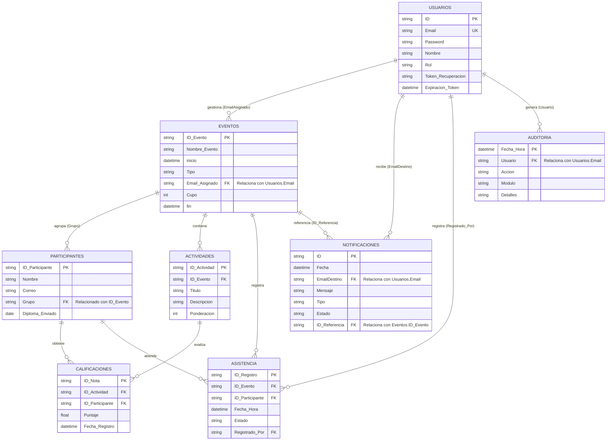

# BASE DE DATOS

[sistema_eventos](https://docs.google.com/spreadsheets/d/1H_3ldHJ3O8O7TC-CNwcMnjDnhpuYnkRfDQh6lzrys3U/edit?usp=sharing)

## Resumen de las Entidades:
- Usuarios: Contiene la información de acceso y perfiles (Admin, Root, Docente).
- Eventos: Registra las actividades programadas, su tipo y el docente responsable asignado mediante su correo.
- Notificaciones: Almacena los mensajes enviados a los usuarios sobre eventos específicos (ID_Referencia).
- Auditoría: Registra el historial de acciones realizadas por los usuarios en el sistema (Login, Crear, Editar, etc.).
- Participantes: Gestiona la inscripción de las personas en los diferentes eventos.
- Actividades: Define tareas, exámenes o trabajos específicos que componen un evento.
- Asistencia: Registra la presencia de los participantes en las sesiones programadas.
- Calificaciones: Gestiona el rendimiento académico de los participantes en las actividades asignadas.
